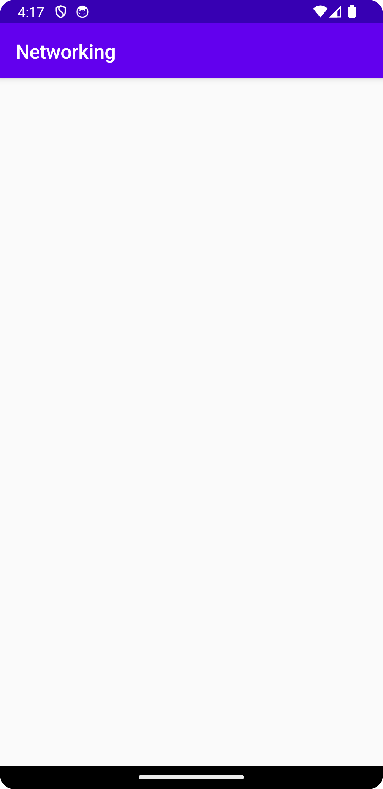

# Rapport

Jag har lagt till en RecyclerView widget och adapter
Skapat en Mountain class som innehåller de variablar som JSON filen innehåller men har
endast en `toString()` metod som ska skriva namnet till en String.

Med hjälp av denna kodsträng så hämtas JSON filen från URL och laddar in till ett object:
`new JsonTask(this).execute(JSON_URL);`

Med denna skickas JSON till en lista med objekt
`Type type = new TypeToken<List<Mountain>>() {}.getType();
listOfMountains = gson.fromJson(json, type);`

Jag har tyvärr inte lyckats med att få bergen att visas i min recyclerView. jag har felsökt och
testat flera olika saker men vet inte vart felet ligger..

Jag skickar in det jag har och vill försöka lösa det i en komplettering.

