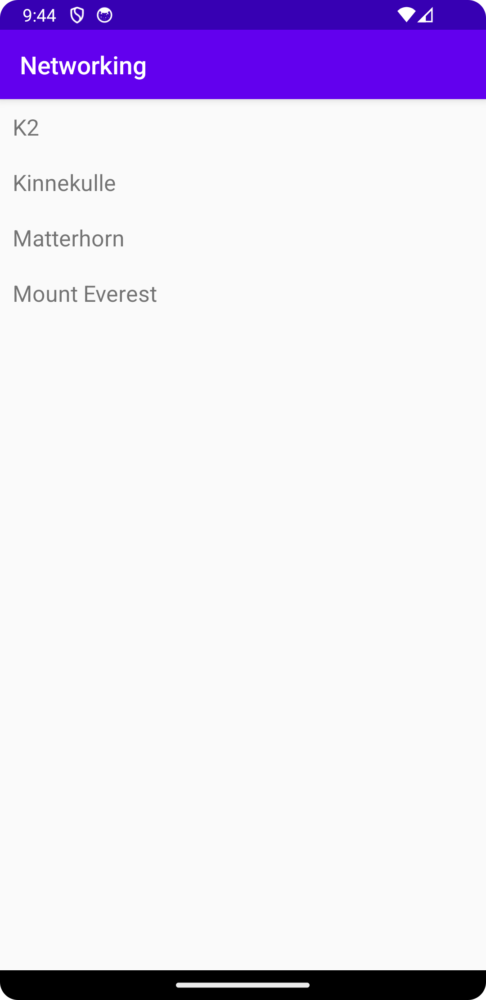

# Rapport

Jag har lagt till en RecyclerView widget och adapter
Skapat en Mountain class som innehåller de variablar som JSON filen innehåller men har
endast en `toString()` metod som ska skriva namnet till en String.

Jag har även skapat en xml-fil "recyclerview_item" som håller koll på layouten på ett "mountain" som 
skickas in i RecyclerView. Med hjälp av denna kod så länkas xml-filen ihop med RecyclerView:
`RecyclerView view = findViewById(R.id.recycler_view);`

Med hjälp av denna kodsträng så hämtas JSON filen från URL och laddar in till ett object:
`new JsonTask(this).execute(JSON_URL);`

Med denna skickas JSON till en lista med objekt
`Type type = new TypeToken<List<Mountain>>() {}.getType();
listOfMountains = gson.fromJson(json, type);`

Jag har tyvärr inte lyckats med att få bergen att visas i min recyclerView. jag har felsökt och
testat flera olika saker men vet inte vart felet ligger..

Till slut lyckades jag lokalisera vad som var fel i koden. Jag hade ingen metod som skickade in
min list med berg i RecyclerView. För att lösa det så fick jag göra följande:

Skapa en metod för att uppdatera min recyclerView med listan av berg
`public void update(ArrayList newMountains){
    mountains.addAll(newMountains);
}`

Kallar på metoden i MainActivity
`adapter.update(listOfMountains);`

